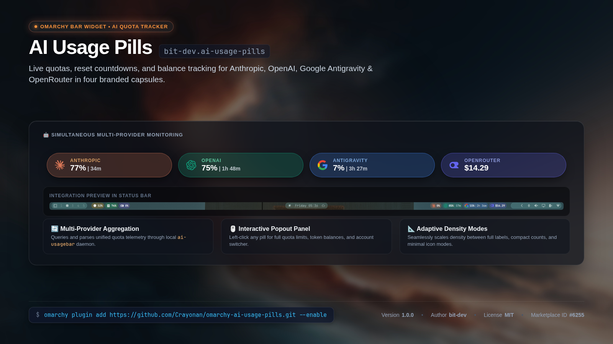

<p align="center">
  
</p>


# AI Usage Pills (`bit-dev.ai-usage-pills`)

A comprehensive Omarchy shell bar widget displaying live usage quotas and metrics for Anthropic, OpenAI, Antigravity Gemini, and OpenRouter in four simultaneous branded pills, backed by an aggregate `ai-usagebar` report.

## Features

- **Four Branded Pills**: Dedicated indicators for Anthropic (Claude), OpenAI (ChatGPT/Codex), Google Antigravity (Gemini), and OpenRouter.
- **Detailed Popout Panel**: Click any pill to view quota limits, remaining credits/requests, reset windows, and status.
- **Quick Actions**:
  - **Left Click**: Open provider detailed usage panel.
  - **Middle Click**: Force immediate data refresh.
  - **Right Click**: Open in-panel appearance and interval settings.
- **Customizable**: Configurable refresh intervals, individual accent colors per provider, and background tint opacity.
- **Adaptive Layout**: Automatically adjusts display density between full, compact, and minimal modes based on bar orientation and available screen width.

## Installation

Install directly using the Omarchy CLI:

```bash
omarchy plugin add https://github.com/Crayonan/omarchy-ai-usage-pills.git --enable
```

If you prefer to install without enabling immediately:

```bash
omarchy plugin add https://github.com/Crayonan/omarchy-ai-usage-pills.git
omarchy plugin enable bit-dev.ai-usage-pills --section right
```

### Configuring OpenRouter

To display OpenRouter usage and credit balance, provide your OpenRouter API key to `ai-usagebar` using either method:

1. **In `~/.config/ai-usagebar/config.toml`** (recommended):
   ```toml
   [openrouter]
   enabled = true
   api_key = "sk-or-v1-..."
   ```

2. **Via environment variable**:
   ```bash
   export OPENROUTER_API_KEY="sk-or-v1-..."
   ```
   Add this to your shell profile (e.g., `~/.bashrc`, `~/.zshrc`, or your desktop environment) so it is available to the Omarchy session.

## Companion Plugins

AI Usage Pills is part of the Omarchy Pill suite and pairs seamlessly with:

| Plugin | Description | Install Command |
|---|---|---|
| **[Pill Bar](https://github.com/Crayonan/omarchy-bar)** (`bit-dev.bar`) | Floating island pill-style status bar for Omarchy | `omarchy plugin add https://github.com/Crayonan/omarchy-bar.git --enable` |
| **[System Pills](https://github.com/Crayonan/omarchy-system-pills)** (`bit-dev.system-pills`) | Live CPU, memory, and GPU usage pills | `omarchy plugin add https://github.com/Crayonan/omarchy-system-pills.git --enable` |

## Removal

To disable the widget from the status bar:

```bash
omarchy plugin disable bit-dev.ai-usage-pills
```

To completely uninstall and delete the plugin files:

```bash
omarchy plugin remove bit-dev.ai-usage-pills
```

## Configuration

Settings can be customized via Omarchy bar widget configuration, the right-click settings panel, or in `~/.config/omarchy/shell.json`:

| Setting | Type | Default | Description |
|---|---|---|---|
| `refreshIntervalSec` | integer | `300` | Polling interval in seconds (30–3600s) |
| `anthropicAccent` | string (hex color) | `#D97757` | Accent color for Anthropic |
| `openaiAccent` | string (hex color) | `#10A37F` | Accent color for OpenAI |
| `antigravityAccent` | string (hex color) | `#4285F4` | Accent color for Google Antigravity |
| `openrouterAccent` | string (hex color) | `#6566F1` | Accent color for OpenRouter |
| `pillOpacity` | number | `0.24` | Background tint opacity (0.08–0.85) |

## Dependencies

- **`ai-usagebar`**: The CLI utility required to query and aggregate AI provider usage metrics. It must be a root-owned regular executable at `/usr/bin/ai-usagebar` or `/usr/local/bin/ai-usagebar`, with no group or other write permission.
- **Linux x86-64**: The plugin ships a static native supervisor at `bin/ai-usage-pills-runner`.
  Its source is `native/ai-usage-pills-runner.c`; `make clean all test` rebuilds it and byte-checks the shipped artifact before release.

The supervisor rejects symlinks and unsafe ownership or modes, executes the validated descriptor directly, bounds each output stream to 64 KiB, and terminates the backend process group after 15 seconds.

## License

This project is licensed under the [MIT License](LICENSE).
